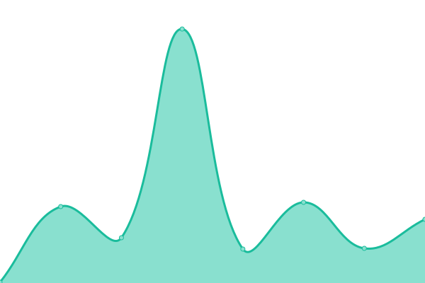

# [📈 Live Status](https://ton-actions.github.io/freeton-status): <!--live status--> **🟩 All systems operational**

This repository contains the open-source uptime monitor and status page for Free TON

<!--start: status pages-->
<!-- This summary is generated by Upptime (https://github.com/upptime/upptime) -->
<!-- Do not edit this manually, your changes will be overwritten -->
<!-- prettier-ignore -->
| URL | Status | History | Response Time | Uptime |
| --- | ------ | ------- | ------------- | ------ |
|  [freeton.org](https://freeton.org) | 🟩 Up | [freeton-org.yml](https://github.com/ton-actions/freeton-status/commits/HEAD/history/freeton-org.yml) | 

 207ms
     
 | 

<a href="https://ton-actions.github.io/freeton-status/history/freeton-org">100.00%</a>
    

|  [Wiki](https://freeton.wiki) | 🟩 Up | [wiki.yml](https://github.com/ton-actions/freeton-status/commits/HEAD/history/wiki.yml) | 

 3917ms
     
 | 

<a href="https://ton-actions.github.io/freeton-status/history/wiki">100.00%</a>
    

|  [Docs](http://docs.ton.dev) | 🟩 Up | [docs.yml](https://github.com/ton-actions/freeton-status/commits/HEAD/history/docs.yml) | 

 778ms
     
 | 

<a href="https://ton-actions.github.io/freeton-status/history/docs">100.00%</a>
    

|  [Forum](https://forum.freeton.org) | 🟩 Up | [forum.yml](https://github.com/ton-actions/freeton-status/commits/HEAD/history/forum.yml) | 

 703ms
     
 | 

<a href="https://ton-actions.github.io/freeton-status/history/forum">100.00%</a>
    

|  [Governance](https://gov.freeton.org) | 🟩 Up | [governance.yml](https://github.com/ton-actions/freeton-status/commits/HEAD/history/governance.yml) | 

 225ms
     
 | 

<a href="https://ton-actions.github.io/freeton-status/history/governance">100.00%</a>
    

|  [main.ton.dev](http://main.ton.dev) | 🟩 Up | [main-ton-dev.yml](https://github.com/ton-actions/freeton-status/commits/HEAD/history/main-ton-dev.yml) | 

 804ms
     
 | 

<a href="https://ton-actions.github.io/freeton-status/history/main-ton-dev">100.00%</a>
    

|  [net.ton.dev](http://net.ton.dev) | 🟩 Up | [net-ton-dev.yml](https://github.com/ton-actions/freeton-status/commits/HEAD/history/net-ton-dev.yml) | 

 743ms
     
 | 

<a href="https://ton-actions.github.io/freeton-status/history/net-ton-dev">100.00%</a>
    

|  [Ton Live](https://ton.live) | 🟩 Up | [ton-live.yml](https://github.com/ton-actions/freeton-status/commits/HEAD/history/ton-live.yml) | 

 107ms
     
 | 

<a href="https://ton-actions.github.io/freeton-status/history/ton-live">100.00%</a>
    

|  [sdkbinaries-ws.tonlabs.io](http://sdkbinaries-ws.tonlabs.io) | 🟩 Up | [sdkbinaries-ws-tonlabs-io.yml](https://github.com/ton-actions/freeton-status/commits/HEAD/history/sdkbinaries-ws-tonlabs-io.yml) | 

 1074ms
     
 | 

<a href="https://ton-actions.github.io/freeton-status/history/sdkbinaries-ws-tonlabs-io">100.00%</a>
    

<!--end: status pages-->

[**Visit our status website →**](https://ton-actions.github.io/freeton-status)

## 📄 License

- Code: [MIT](./LICENSE) © [Ton Actions](https://github.com/ton-actions)
- Data in the `./history` directory: [Open Database License](https://opendatacommons.org/licenses/odbl/1-0/)
